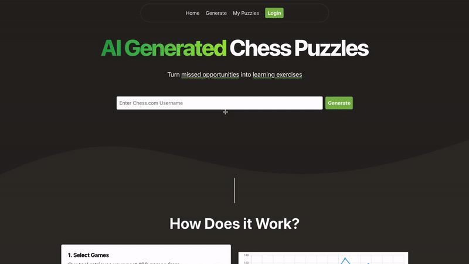

# Chessir - AI Generated Chess Puzzles

This is **Chessir**, a platform which will analyze your chess games and output chess puzzles for you to train on. 

[Try it at www.chessir.com](https://www.chessir.com)



## Backend Architecture

```
REST API: This project uses Quart (an async version of Python Flask)
```

```
Concurrent Processing: Celery, Redis, Gunicorn
```

```
Infrastructure: Docker and AWS
```
